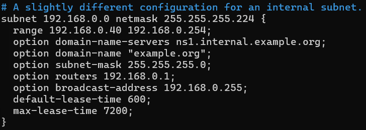
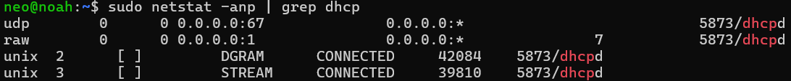
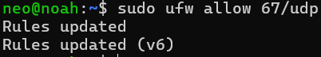
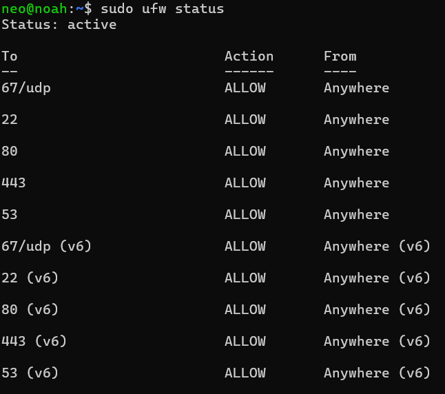
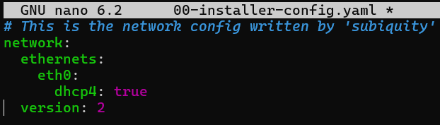
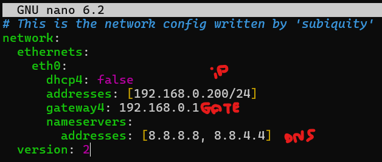
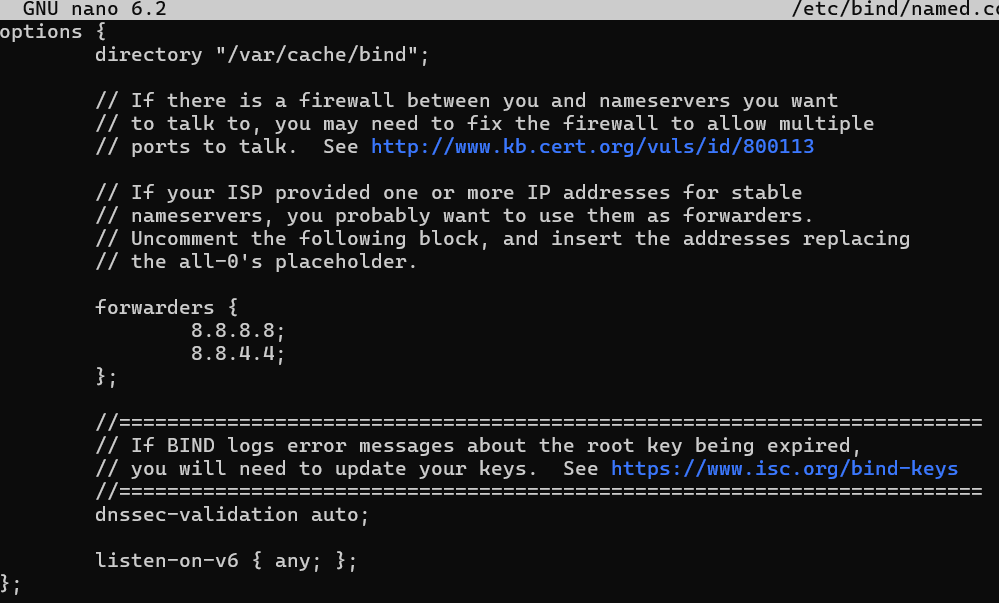
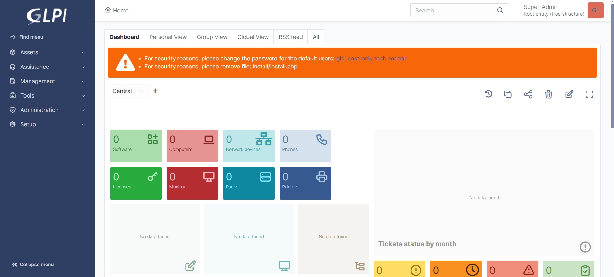

# UbuntuServer

Welcome to the Linux server project! In this assignment, we will be setting up a Linux infrastructure consisting of a server and a workstation to demonstrate the functionality of various network services. This project is part of a consolidation challenge and must be completed within a duration of 3 days, with a deadline of 04/04/2024.

This project aims to showcase the capabilities of Linux in a local library scenario where Windows licenses are not available. We will be using virtual machines and an internal virtual network to simulate the setup, ensuring that our DHCP does not interfere with the LAN.

You will find detailed instructions and documentation for setting up the Linux infrastructure below. Additionally, a summary of the project requirements and evaluation criteria is provided.

For the complete assignment document, please refer to [Assignment](/Assignment.md)

Let's dive into the setup process and demonstrate the power of Linux network services!

----
# Installation Guide

## 1. Installing Ubuntu Server
- Install Ubuntu Server.
- Set up the root password.
- Configure a user.

  
See step by step

  
  
  
  
  
  
  
  
  

## 2. Configuring ISC DHCP Server
- Install `isc-dhcp-server`.
- Configure `/etc/dhcp/dhcpd.conf`.
  

## 3. Installing net-tools and Firewall Configuration
- Install `net-tools` to use `netstat`.
- Allow necessary ports in the firewall.
  
  
  

## 4. Assigning a Static IP Address
- Use Netplan to configure a static IP.
- Modify `/etc/netplan/config.yaml`.
  
  
- Apply the configuration with `sudo netplan apply`.

## 5. Installing and Configuring BIND9 (DNS)
- Install `bind9`, `bind9utils`, and `bind9-doc`.

  
 Configure zone files and configuration files.

  

  - `named.conf.options`
    

  - `db.example.com`
    

  - `db.192`
    

  - `named.conf.local`
    

- Restart BIND9 with `sudo systemctl restart bind9`.
- Enable the firewall and allow BIND9.
  

## 6. Installing Apache HTTP Server
- Update the system.
- Install Apache2.
- Check the IP address in the browser.
- Modify the content of `/var/www/html/` to display your website.

## 7. Installing MariaDB and GLPI
- Download GLPI from GitHub.
- Extract the files into `/var/www/html/`.
- Change the permissions of the GLPI directory.
- Install MariaDB.
- Create a database for GLPI.
- Create a MySQL user for GLPI.
- Restart Apache.
- Access `localhost/glpi` in a browser and follow the instructions.
  

  # Conclusion

  In this guide, we've successfully set up a Linux server environment to demonstrate essential network services like DHCP, DNS, and HTTP. Through careful configuration and troubleshooting, we've ensured that each component functions smoothly, laying the groundwork for a reliable infrastructure. With our documentation and live demo, we're ready to showcase our Linux server solution to the local library and address any questions or concerns they may have. This marks the completion of our project, showcasing the power and flexibility of Linux in meeting the library's needs.